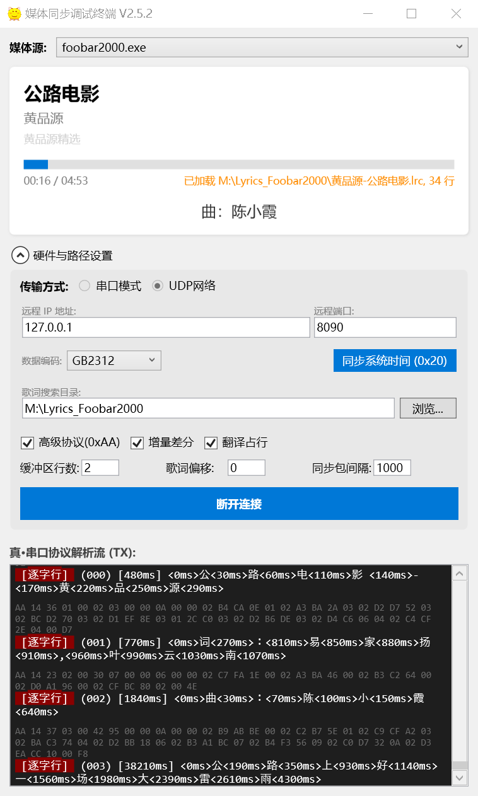
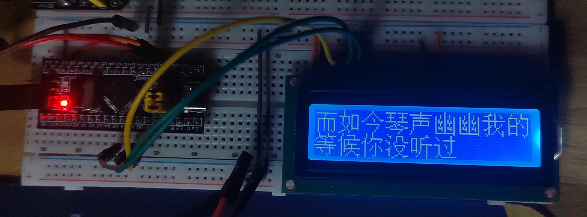
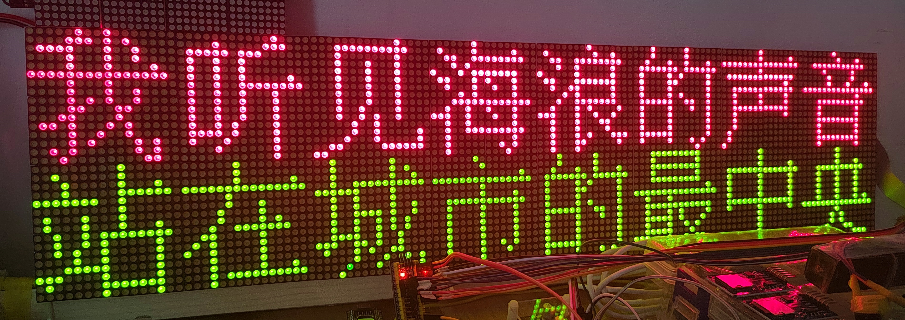
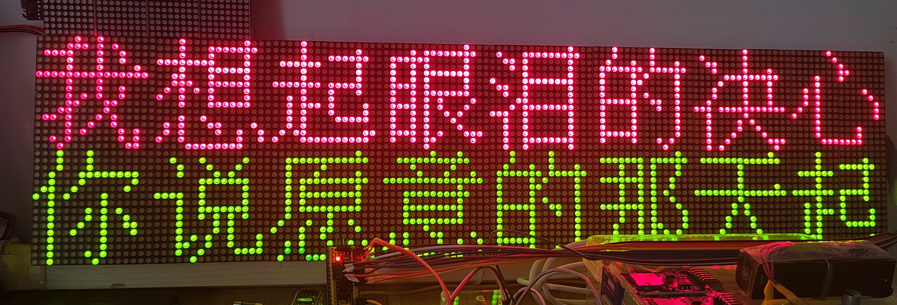

# 媒体同步调试终端 (MediaMonitor) v2.5

基于 WPF 开发的媒体信息同步网关，专为嵌入式显示屏（OLED/LCD）调试设计。支持 Windows 全局媒体抓取（SMTC）、逐字歌词解析、以及高度可自定义的二进制/文本双模协议，支持串口与 UDP 双链路传输。

## 🌟 核心特性

* **全自动媒体抓取**：自动识别 Windows 当前播放的音乐应用（网易云、QQ音乐、Spotify 等）。
* **跨平台传输链路**：
    * **Serial 模式**：适配传统单片机串口调试。
    * **UDP 模式**：适配 ESP32/ESP8266 等 Wi-Fi 硬件，支持远程同步。
* **双向交互协议**：
    * **下行 (0xAA)**：高频同步媒体元数据、状态及歌词。
    * **上行 (0xAB)**：支持硬件按键回控 PC（下一曲、播放/暂停等）。
* **逐字歌词同步**：支持 `.lrc` 格式，不仅能同步整行，还支持高级模式下的逐字（Word-by-word）显示。
* **工业级交互体验**：
    * **全局回车同步**：所有配置输入框支持回车即时生效，无需切换焦点。
    * **差分增量发送**：仅在内容变化时发送数据，极大地节省带宽。
* **工业级日志**：控制台式自动清理逻辑，防止长时间运行导致的内存溢出。

---

## 🛠 通信协议说明

### 下行协议 (PC -> 硬件, 头码 `0xAA`)
格式：`0xAA [指令号] [长度] [载荷] [校验和]`
*(校验和 = 指令 + 长度 + 所有载荷字节的低 8 位)*

| 指令 (Cmd) | 功能描述 | 载荷说明 |
| :--- | :--- | :--- |
| **0x10** | 媒体元数据 | 标题长度+标题、歌手长度+歌手、专辑长度+专辑 |
| **0x11** | 播放状态同步 | 1B(状态) + 4B(当前ms) + 4B(总长度ms) |
| **0x12** | 原文行同步 | 内容字符串 (UTF-8/GB2312) |
| **0x13** | 翻译行同步 | 翻译内容字符串 |
| **0x14** | 逐字动态行 | 4B(开始时间) + 1B(词数) + [2B偏移+1B长度+文本]*N |
| **0x15** | **增强原文行** | **内容字符串 + 4B(持续时间ms)** (待实现) |
| **0x16** | **协议纯文本** | **封装在 0xAA 结构下的纯文本字符串** (待实现) |

### 上行协议 (硬件 -> PC, 头码 `0xAB`)
格式：`0xAB [指令号] [长度] [载荷] [校验和]`

| 指令 (Cmd) | 功能描述 | 载荷说明 |
| :--- | :--- | :--- |
| **0xA1** | 下一曲 (Next) | 无载荷 |
| **0xA2** | 上一曲 (Previous) | 无载荷 |
| **0xA3** | 播放/暂停 (Play/Pause) | 无载荷 |

---

## 🚀 快速开始

1.  **配置**：通过界面指定串口参数或 UDP 远程 IP/端口。修改后**按下回车键**即可立即应用配置。
2.  **连接**：选择 "Serial" 或 "UDP" 模式，点击连接。
3.  **运行**：播放音乐，观察 `HexPreview` 的实时协议解析流。硬件端发送 `0xAB A1 00 00` 即可测试切歌。

---

## 📂 项目架构

* **Transport 层**：抽象 `IMediaTransport` 接口，解耦业务逻辑与底层物理链路（Serial/UDP）。
* **Command 处理器**：`CommandProcessor` 负责解析 `0xAB` 上行指令并调用系统接口。
* **同步核心**：`PackageMaster` 统筹状态抓取与发包频率控制。

---

## 📝 TODO (后续计划)

* [ ] **协议优化**：实现 `0x15` 指令，解决单片机端因缺少持续时间导致的末行显示残留问题。
* [ ] **协议优化**：实现 `0x16` 指令，为简单显示需求提供带校验的纯文本封装。
* [ ] **硬件端**：编写 ESP32 的双向转发固件（UDP <-> Serial）。
* [ ] **硬件端**：STM32 适配红外/旋转编码器的 `0xAB` 指令上报逻辑。

---

> **Note:** 这是一个追求“逻辑完美”的项目，每一行代码都经过了极限拉扯与调试。目前版本已通过 `RaiseEvent` 机制完美解决了非绑定模式下的 UI 响应问题。