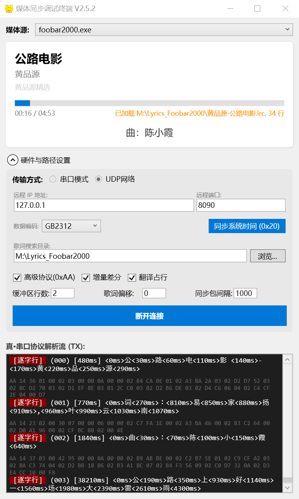
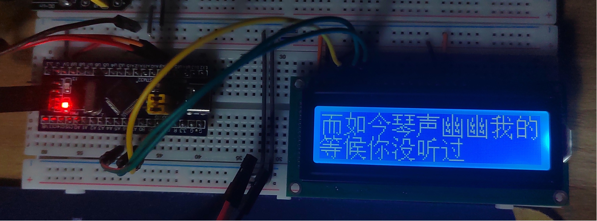
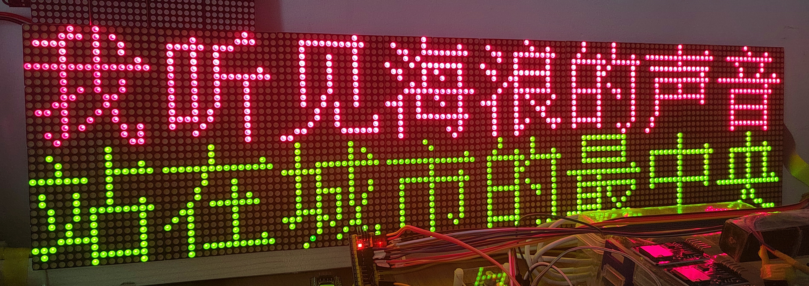
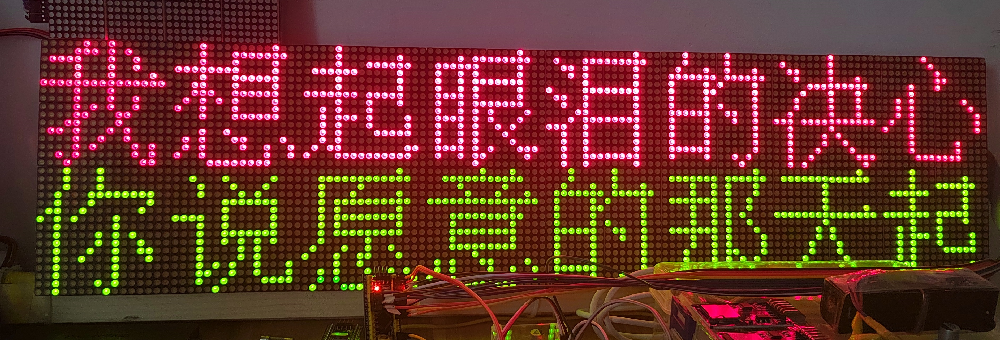

# 媒体同步调试终端 (MediaMonitor) v2.5

基于 WPF 开发的媒体信息同步网关，专为嵌入式显示屏（OLED/LCD）调试设计。支持 Windows 全局媒体抓取（SMTC）、逐字歌词解析、以及高度可自定义的二进制/文本双模协议，支持串口与 UDP 双链路传输。

## 🌟 核心特性

* **全自动媒体抓取**：自动识别 Windows 当前播放的音乐应用（网易云、QQ音乐、Spotify 等）。
* **跨平台传输链路**：
    * **Serial 模式**：适配传统单片机串口调试。
    * **UDP 模式**：适配 ESP32/ESP8266 等 Wi-Fi 硬件，支持远程同步。
* **双向交互协议**：
    * **下行 (0xAA)**：高频同步媒体元数据、状态及歌词。
    * **上行 (0xAB)**：支持硬件按键回控 PC（下一曲、播放/暂停等）。
* **逐字歌词同步**：支持 `.lrc` 格式，不仅能同步整行，还支持高级模式下的逐字（Word-by-word）显示。
* **工业级交互体验**：
    * **全局回车同步**：所有配置输入框支持回车即时生效，无需切换焦点。
    * **差分增量发送**：仅在内容变化时发送数据，极大地节省带宽。
* **工业级日志**：控制台式自动清理逻辑，防止长时间运行导致的内存溢出。

---

## 🛠 通信协议说明

### 下行协议 (PC -> 硬件, 头码 `0xAA`)
格式：`0xAA [指令号] [LenH] [LenL] [载荷...] [校验和]`
*(长度=LenH<<8|LenL，为载荷字节数；校验和= 0xAA ^ 指令 ^ LenH ^ LenL ^ 所有载荷 的全帧异或)*

| 指令 (Cmd) | 功能描述 | 载荷说明 |
| :--- | :--- | :--- |
| **0x10** | 媒体元数据 | 标题长度+标题、歌手长度+歌手、专辑长度+专辑 |
| **0x11** | 播放状态同步 | 1B(状态) + 4B(当前ms) + 4B(总长度ms) |
| **0x12** | 原文行同步 | 2B(索引) + 4B(开始时间ms) + 内容字符串 (UTF-8/GB2312) |
| **0x13** | 翻译行同步 | 2B(索引) + 4B(开始时间ms) + 翻译内容字符串 |
| **0x14** | 逐字动态行 | 2B(索引) + 4B(开始时间ms) + 1B(词数) + [2B偏移+1B长度+文本]*N |
| **0x15** | **增强原文行** | 2B(索引) + 4B(开始时间ms) + 4B(结束时间ms) + 内容字符串 |
| **0x16** | **协议纯文本** | **封装在 0xAA 结构下的纯文本字符串** |
| **0x1F** | **全链路延迟探测 Ping** | 1B(目标ID, `0x01`=串口STM32主设备) + 4B(C#_T1_ms, uint32 小端) |

### 上行协议 (硬件 -> PC, 头码 `0xAB`)
格式：`0xAB [指令号] [LenH] [LenL] [载荷...] [校验和]`
*(长度=LenH<<8|LenL，为载荷字节数；校验和= 0xAB ^ 指令 ^ LenH ^ LenL ^ 所有载荷 的全帧异或)*

| 指令 (Cmd) | 功能描述 | 载荷说明 |
| :--- | :--- | :--- |
| **0xA1** | 下一曲 (Next) | 无载荷 -> `AB A1 00 00 00` |
| **0xA2** | 上一曲 (Previous) | 无载荷 -> `AB A2 00 00 00` |
| **0xA3** | 播放/暂停 (Play/Pause) | 无载荷 -> `AB A3 00 00 00` |
| **0xA5** | 快进 +5s | 无载荷 |
| **0xA6** | 快退 -5s | 无载荷 |
| **0xAF** | **全链路延迟回包 Pong** | 1B(Dev_ID, `0x01`) + 4B(C#_T1_ms 原样透传) + 4B(STM32_Proc_us, uint32 小端) |

---

## 📶 全链路 UDP/UART 延迟测试

测量 **PC → UDP → ESP32 → UART → STM32** 的单向传输延迟，为 B 端时间轴同步算法提供 **固化延迟 `D_base`** 与 **网络抖动 Jitter**，并通过"RTT 双向测距 + 硬件端处理耗时扣除 + 上位机滑窗统计"消除两端晶振时钟不同步与主循环排队耗时的干扰。

### 🧮 原理：RTT 双向测距 + 处理耗时扣除

上位机按固定间隔下发 `0x1F` Ping（携带毫秒时间戳 `T1`），硬件**原样回传 `T1`** 并附上自己"从 DMA 接收中断打点 → 主循环组包完成"的微秒耗时 `proc_us`：

```text
RTT      = T2_Recv - T1_Send
OneWay   = (RTT - proc_us / 1000.0) / 2
```

| 处理 | 作用 |
| :--- | :--- |
| 减去 `proc_us` | 剔除 STM32 主循环排队/组包耗时，只留链路与协议本身的耗时 |
| 除以 2 | 单向 ≈ 往返的一半，同时消除两端晶振不同步与上下行不对称 |

> **精度说明**：协议里的 `T1` 仍是 `uint32` 毫秒（硬件零改动），但上位机用 `Stopwatch` 单调时钟打点，并维护 `T1 → 精确发送时刻` 映射把 RTT 还原到微秒级，
> 从而避开 `Environment.TickCount64` 在 Windows 上约 **15.6ms** 的量化误差（实测 RTT 抖动只有 0.1ms 级）。

### 📊 统计口径（滑动窗口 30 样本，默认 100ms/包）

| 指标 | 定义 | 用途 |
| :--- | :--- | :--- |
| **Base 固化延迟** | 窗口内**最小值** `min(L)` | 物理极速链路，可作为 `D_base` |
| **Avg 平均延迟** | 窗口内均值 | 观察典型表现 |
| **Jitter 网络抖动** | 窗口内样本偏离基线(Base)的平均偏差 `mean(\|L_i - Base\|)` | 判断链路稳定性 |

- 集满 30 个样本（约 3 秒）自动结束；测量中再点一次按钮可**中途停止并按当前窗口结算**。
- **两段式无回包保护**（都不会误伤"链路慢"的正常情况）：
  - **等待告警**：连续 `LatencyWarnMs`（默认 **3s**）没有任何回包 → 只在日志里提醒"仍在等待…"，**不停止**；
  - **停止超时**：连续 `LatencyTimeoutMs`（默认 **10s**）一个包都没收到 → 才结束并提示排查方向；
  - **单次时长上限**：`max(30s, 超时×3)`，防止"回包很慢但一直有"时窗口迟迟填不满（到点按已采集样本结算）。

| config.json 可调项 | 默认 | 说明 |
| :--- | :--- | :--- |
| `LatencyTimeoutMs` | `10000` | 连续无回包的停止超时(ms)，1s~120s |
| `LatencyWarnMs` | `3000` | 连续无回包的等待告警阈值(ms)，0.5s~超时值 |

> 首包慢的典型来源：ESP32 刚从 Wi-Fi modem-sleep 唤醒 / 首次 ARP 解析 / STM32 主循环正忙（`proc_us` 偏大）/ 串口 TX 排队。这些场景下 3 秒确实会误判，所以停止阈值默认放宽到 10 秒。
- 结果直接显示在按钮上（如 `延迟 3.21ms`），鼠标悬停可看 Base / Avg / Jitter / 样本数，逐样本明细同步打进下方 `HexPreview` 日志。

### 🔌 使用步骤

1. 选择 **传输方式**（串口 / UDP）→ 填好参数 → 点击 **开始连接**（两种链路都能测，底层逻辑完全一致）；
2. 点击 **测延迟** → 按钮显示 `测量中 12/30` → 约 3 秒后显示 `延迟 x.xxms`；
3. 参考测得的 Base **手动**填写 **同步偏移(ms)**（程序不会自动改写你的配置）；
4. 复测直接再点一次即可。

### 💻 C# 接入示例（传输无关）

核心类 `Services/ProtocolLatencyTester.cs` 不持有任何 socket，只依赖"发帧委托 + 喂原始字节"两个注入点，换成 BLE 等新链路同样即插即用；完整按钮交互封装在 `UI/LatencyTestController.cs`。

```csharp
var tester = new ProtocolLatencyTester(frame => App.TransportMgr.SendImmediate(frame))
{
    PingIntervalMs = 100,    // 发包间隔
    ReplyTimeoutMs = 3000    // 无回包超时
};

tester.LogMessage   += msg => App.LogSvc?.LogInfo(msg, Brushes.DeepSkyBlue);
tester.StatsUpdated += s   => Console.WriteLine($"测量中 {s.SampleCount}/{tester.WindowSize}");
tester.Completed    += s   => Console.WriteLine($"Base={s.BaseMs:F2}ms Avg={s.AvgMs:F2}ms Jitter={s.JitterMs:F2}ms");

// 底层收到的原始字节喂进来：UDP 是整包、串口是任意切片，内部自行按 0xAB 搜头 + XOR 校验分帧
App.TransportMgr.OnRawDataReceived += tester.FeedRawData;

tester.Start(windowSize: 30);
```

> 发帧走 `TransportManager.SendImmediate`（直发）而非 `Send`：后者会进节流队列被 `SendIntervalMs` 拖慢（播放中歌词包排队会带来 10~20ms 偏置），
> 也会把 `0x1F` 当"未知指令"高频写日志刷屏（触发日志框自动清空）。

### 🐍 无硬件调试：Python 模拟器

`A_tools/mock_esp32_stm32.py` 用标准库模拟 ESP32 + STM32 的整条回包链路（随机 `proc_us` 500~2000us、链路时延 2~10ms），仅需 `socket / struct / time / random / argparse`，无需 pip 安装：

```bash
cd MediaMonitor_App\A_tools

# 【同机调试推荐】监听 127.0.0.1:8080，上位机「远程 IP」填 127.0.0.1、端口 8080
python mock_esp32_stm32.py --ip 127.0.0.1 --port 8080

# 默认监听 0.0.0.0:8080（给"脚本在另一台机器/板子"的场景用；0.0.0.0 只是监听地址，别填进上位机的远程 IP）
python mock_esp32_stm32.py

# 与你的 RemotePort 对齐
python mock_esp32_stm32.py --port 5555

# 固定耗时便于校验公式：proc=1ms、链路往返=4ms → 期望单向 = 2.0ms
python mock_esp32_stm32.py --port 5555 --proc-min 1000 --proc-max 1000 --link-min 4 --link-max 4

# 其它开关：--loss 0.3 模拟 30% 丢包（验证超时保护）、--quiet 不逐帧打印
```

输出示例：

```text
[忽略] 非法/非 Ping 帧 17B: AA 10 00 0D 03 E5 8D 95 E6 9C 88 ...   ← 正常！上位机还会发 0x10/0x11/0x15 等常规帧，mock 只认 0x1F
[0001] <- Ping(T1=12543ms)  回 Pong: Dev=0x01 proc=1312us link=5.31ms -> 192.168.1.20:52341   (累计 1)
```

> 看到 `[忽略] 非法/非 Ping 帧` **不要慌**：那是上位机的常规同步帧（`0x10` 元数据、`0x11` 进度、`0x15` 歌词…），mock 按设计忽略了它们（打印按秒节流，不会淹掉 Ping 行）。
> 真正要看的是有没有 `<- Ping` 行：**有**说明 `0x1F` 已送达；**没有**说明上位机压根没发出来或没送到（见下方排障表）。

> **模拟器的时延是准的**：脚本用 `precise_sleep()`（自旋补偿）而不是裸 `time.sleep()`。Windows 上 `time.sleep` 粒度约 **15.6ms**，
> 直接 sleep 会把"声明 0.5~2ms 的 `proc_us`"实际睡成 8~15.6ms，而 `proc_us` 是按声明值扣除的 → 测得的延迟会**虚高好几倍**；
> 同时 `serve_ping()` 在**独立线程**里模拟 proc+链路时延，收包循环永不阻塞（否则业务流量突发会挤爆接收缓冲 → 丢包 + 积压）。

> **注意 IP 填写方向**：`0.0.0.0` 是脚本这边的**监听地址**，只能出现在脚本参数里；
> 上位机的「远程 IP」必须填 **`127.0.0.1`**（脚本与上位机同机）或**本机局域网 IP**（如 `192.168.214.189`，脚本/板子需要把回包送回本机时用），
> **绝对不能填 `0.0.0.0`** —— 那会让 `sendto` 报 `10049 在其上下文中，该请求的地址无效`（程序会在连接时直接拦下并说明原因）。
> 上位机的「远程端口」填脚本的 `--port`。

> 串口模式暂不提供模拟（`pyserial` 不是标准库）：请用真硬件，或用 **com0com** 等虚拟串口对 + 简单转发脚本。

### 🔧 STM32 端实现说明

```c
/* ---- 1. 使能 DWT 周期计数器（Cortex-M3/M4） ---- */
#define CPU_FREQ_HZ  72000000UL                         /* 按你的主频填 */

static void DWT_Init(void)
{
    CoreDebug->DEMCR |= CoreDebug_DEMCR_TRCENA_Msk;     /* 使能跟踪单元 */
    DWT->CYCCNT = 0;
    DWT->CTRL  |= DWT_CTRL_CYCCNTENA_Msk;               /* 开周期计数器 */
}

/* ---- 2. 串口 DMA + IDLE 中断：抓"帧收完"的时间戳 ---- */
static volatile uint32_t g_rx_cyccnt;                   /* 中断里只存周期数，开销极小 */

void USART1_IRQHandler(void)
{
    if (USART1->SR & USART_SR_IDLE)                     /* 一帧收完（总线空闲） */
    {
        (void)USART1->DR;                               /* 读 DR 清 IDLE 标志 */
        g_rx_cyccnt = DWT->CYCCNT;                      /* ← 延迟测试的关键时间戳 t_rx */
        /* ... 你原有的 DMA 收包处理 / 置标志位 ... */
    }
}

/* ---- 3. 主循环组包：算 proc_us 并回 0xAF ---- */
void HandleLatencyPing(uint8_t target_id, uint32_t t1_ms)
{
    if (target_id != 0x01) return;                      /* 主从过滤：非主设备静默丢弃 */

    uint32_t t_tx_cyc = DWT->CYCCNT;                    /* 组包时刻 */
    uint32_t proc_us  = (uint32_t)((uint64_t)(t_tx_cyc - g_rx_cyccnt) * 1000000ULL / CPU_FREQ_HZ);

    uint8_t  frame[14];
    uint8_t *p = frame;
    *p++ = 0xAB; *p++ = 0xAF; *p++ = 0x00; *p++ = 0x09; /* 头 + 指令 + Len=9 */
    *p++ = 0x01;                                        /* Dev_ID */
    memcpy(p, &t1_ms, 4);   p += 4;                     /* C#_T1_ms 原样透传（小端） */
    memcpy(p, &proc_us, 4); p += 4;                     /* STM32_Proc_us（小端） */

    uint8_t check = 0;
    for (int i = 0; i < 13; i++) check ^= frame[i];     /* 全帧异或（不含校验位本身） */
    frame[13] = check;
    UART_Send(frame, sizeof(frame));                    /* 发回 ESP32 → UDP → PC */
}
```

**注意事项**

- `t_tx_cyc - g_rx_cyccnt` 用**无符号减法**：`DWT->CYCCNT` 回绕（72MHz 约 59.6s）时结果依然正确。
- `proc_us` 只统计"串口收完 → 组包完成"，**不要**把 UART 发送耗时算进去，否则会被上位机当成链路延迟扣掉。
- 主频会变的场景（低功耗/超频）请改用固定 1MHz 的定时器计数替代 DWT 周期数。
- `proc_us` 填 0 时上位机会打**告警**：结果仍可用，但会包含主循环排队耗时（数值偏大）。
- ESP32 侧只做透传时要**逐字节原样转发**，不要重打包、不要过滤 `0xAA/0xAB`，也不要拆分/合并 UDP 报文。
- 串口 115200bps 下一帧 10 字节约 0.87ms，本身就会进入测量值；想看纯 UDP 链路请切到 UDP 模式对比。

### 🧯 常见问题排查

| 现象 | 原因 | 处理 |
| :--- | :--- | :--- |
| 日志 `10049 在其上下文中，该请求的地址无效` | 「远程 IP」填了 `0.0.0.0`（监听地址不能当发送目标） | 填 `127.0.0.1`（同机）或对端局域网 IP |
| 日志 `10054 ... 端口不可达` / 对端只零星收到几帧后**彻底没反应** | 对端（mock/ESP32）当时没在运行，UDP 收到 ICMP 端口不可达；**旧版本会因此把 UDP 链路"哑死"** | 本版本已修复：10054 不再关闭链路，会持续重试并为后续发包正常工作；只需启动对端即可，必要时重连一次 |
| 按钮 3 秒后回到「测延迟」，日志 `未收到 0xAF 回包` | 对端在跑但不认 `0x1F`：Target_ID 不是 `0x01`、ESP32 没逐字节透传、防火墙拦截 | 对照 `0x1F/0xAF` 帧格式核对；先用 mock 脚本自检 |
| 日志 `已等待 3000ms 仍无 0xAF 回包…继续等待到 10000ms` | 对端首包慢（ESP32 唤醒/ARP/主循环忙）或确实没在跑 | 属**提醒不停止**；若确认对端有问题可直接再点一次按钮手动停止，或调大 `LatencyTimeoutMs` |
| 日志 `已达单次测试时长上限 xxx ms，按已采集样本结算` | 回包很慢但一直有，窗口迟迟填不满 | 正常兜底；想更久可调大 `LatencyTimeoutMs`（上限随之×3） |
| 日志 `链路已断开（本机 UDP 客户端已被关闭）` | 本机 UDP socket 已失效 | 重新点击「开始连接」 |
| 日志 `UDP 未连接或链路已断开，数据被丢弃` | 未连接就发包，或链路中途断开 | 重新点击「开始连接」 |
| mock 一直刷 `[忽略] 非法/非 Ping 帧` | 那都是上位机的 `0x10/0x11/0x15` 常规帧 | 正常现象（打印已按秒节流），看有没有 `<- Ping` 行即可 |
| 测得延迟比预期**大好几倍**、mock 一行行 `<- Ping` 很少 | 旧版 mock 的两个缺陷：`time.sleep` 粒度 15.6ms 让 `proc_us` 实际睡成 8~15.6ms；单线程阻塞收包被业务流量挤爆缓冲 | 已修复（`precise_sleep` + 独立线程回包 + 1MB 接收缓冲）；另建议**测延迟时不要同时播放音乐**，或临时把 `SendIntervalMs` 调大到 30~50ms |

---

## 🚀 快速开始

1.  **配置**：通过界面指定串口参数或 UDP 远程 IP/端口。修改后**按下回车键**即可立即应用配置。
2.  **连接**：选择 "Serial" 或 "UDP" 模式，点击连接。
3.  **运行**：播放音乐，观察 `HexPreview` 的实时协议解析流。硬件端发送 `0xAB A1 00 00 00` (下一曲) 或 `0xAB A3 00 00 00` (播放/暂停) 即可测试回控。






---

## 📂 项目架构

* **Transport 层**：抽象 `IMediaTransport` 接口，解耦业务逻辑与底层物理链路（Serial/UDP）。
* **Command 处理器**：`CommandProcessor` 负责解析 `0xAB` 上行指令并调用系统接口。
* **同步核心**：`PackageMaster` 统筹状态抓取与发包频率控制。

---

## 📝 TODO (后续计划)

* [x] **协议优化**：实现 `0x15` 指令，解决单片机端因缺少持续时间导致的末行显示残留问题（已实现，普通行默认发 0x15，末行使用播放总时长/+5s 作为结束时间）。
* [ ] **协议优化**：实现 `0x16` 指令，为简单显示需求提供带校验的纯文本封装。
* [ ] **硬件端**：编写 ESP32 的双向转发固件（UDP <-> Serial）。
* [ ] **硬件端**：STM32 适配红外/旋转编码器的 `0xAB` 指令上报逻辑。

---

> **Note:** 这是一个追求“逻辑完美”的项目，每一行代码都经过了极限拉扯与调试。目前版本已通过 `RaiseEvent` 机制完美解决了非绑定模式下的 UI 响应问题。