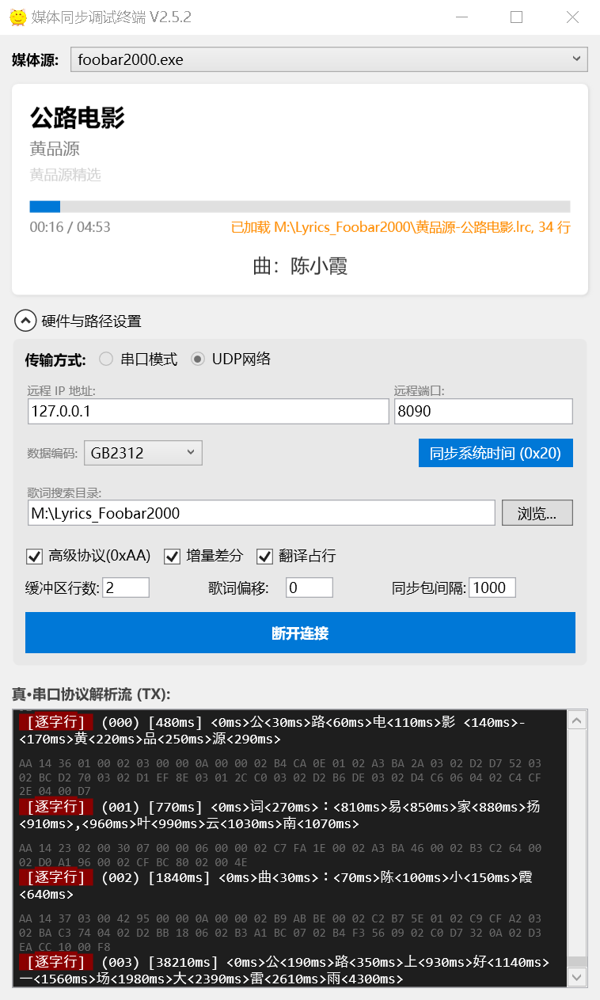
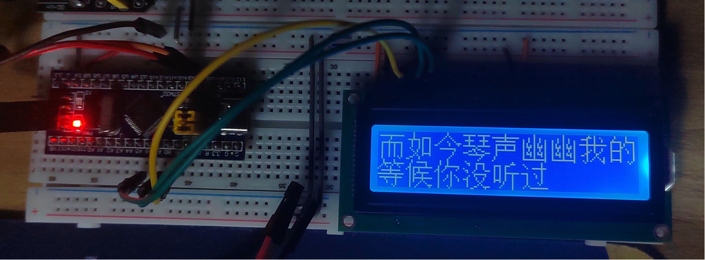
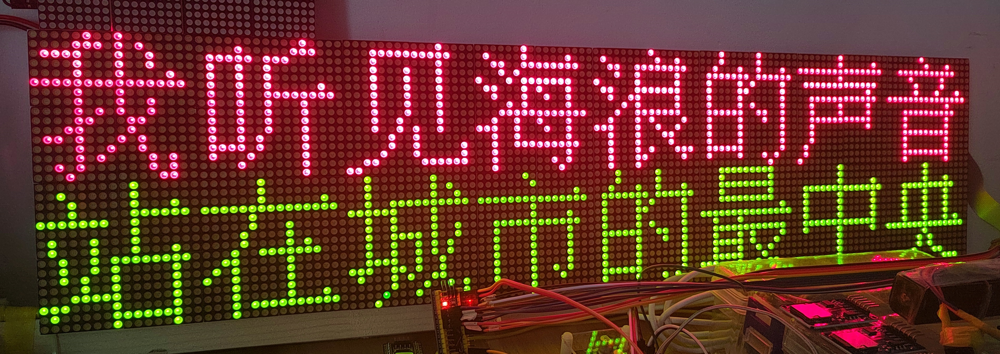
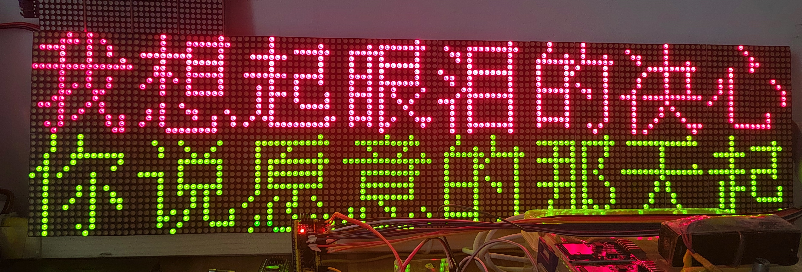

# 媒体同步调试终端 (MediaMonitor)

基于 WPF 开发的媒体信息同步网关，专为嵌入式显示屏（OLED/LCD）调试设计。支持 Windows 全局媒体抓取（SMTC）、逐字歌词解析、以及高度可自定义的二进制/文本双模协议，支持串口与 UDP 双链路传输。

## 🌟 核心特性

* **全自动媒体抓取**：自动识别 Windows 当前播放的音乐应用（网易云、QQ音乐、Spotify 等）。
* **跨平台传输链路**：
    * **Serial 模式**：适配传统单片机串口调试。
    * **UDP 模式**：适配 ESP32/ESP8266 等 Wi-Fi 硬件，支持远程同步。
* **双向交互协议**：
    * **下行 (0xAA)**：高频同步媒体元数据、状态及歌词。
    * **上行 (0xAB)**：支持硬件按键回控 PC（下一曲、播放/暂停等）。
* **逐字歌词同步**：支持 `.lrc` 格式，不仅能同步整行，还支持高级模式下的逐字（Word-by-word）显示。
* **工业级交互体验**：
    * **全局回车同步**：所有配置输入框支持回车即时生效，无需切换焦点。
    * **差分增量发送**：仅在内容变化时发送数据，极大地节省带宽。
* **工业级日志**：控制台式自动清理逻辑，防止长时间运行导致的内存溢出。

---

## 🛠 通信协议说明

### 下行协议 (PC -> 硬件, 头码 `0xAA`)
格式：`0xAA [指令号] [LenH] [LenL] [载荷...] [校验和]`
*(长度=LenH<<8|LenL，为载荷字节数；校验和= 0xAA ^ 指令 ^ LenH ^ LenL ^ 所有载荷 的全帧异或)*

| 指令 (Cmd) | 功能描述 | 载荷说明 |
| :--- | :--- | :--- |
| **0x10** | 媒体元数据 | 标题长度+标题、歌手长度+歌手、专辑长度+专辑 |
| **0x11** | 播放状态同步 | 1B(状态) + 4B(当前ms) + 4B(总长度ms) |
| **0x12** | 原文行同步 | 2B(索引) + 4B(开始时间ms) + 内容字符串 (UTF-8/GB2312) |
| **0x13** | 翻译行同步 | 2B(索引) + 4B(开始时间ms) + 翻译内容字符串 |
| **0x14** | 逐字动态行 | 2B(索引) + 4B(开始时间ms) + 1B(词数) + [2B偏移+1B长度+文本]*N |
| **0x15** | **增强原文行** | 2B(索引) + 4B(开始时间ms) + 4B(结束时间ms) + 内容字符串 |
| **0x16** | **协议纯文本** | **封装在 0xAA 结构下的纯文本字符串** |
| **0x1F** | **全链路延迟探测 Ping** | 1B(目标ID, 默认 `0x01`=串口STM32主设备，可用 config.json 的 `TargetSerialMaster` 改) + 4B(C#_T1_ms, uint32 小端) |

> **空元数据 = 硬件复位的参考信号**：当标题/歌手/专辑三个字段长度都为 `0`（载荷 `00 00 00`，整帧形如 `AA 10 00 03 00 00 00 B9`）时，表示上位机当前**没有媒体信息**（播放器未启动 / 已退出 / 会话被清空）。
> 硬件可据此复位显示：清屏 + 停止时间轴推进。上位机在「无歌曲状态下重新连接」时会自动发出这一帧，所以**手动点一次「断开 → 开始连接」就能复位硬件**（前提是硬件按此规则实现）。

### 上行协议 (硬件 -> PC, 头码 `0xAB`)
格式：`0xAB [指令号] [LenH] [LenL] [载荷...] [校验和]`
*(长度=LenH<<8|LenL，为载荷字节数；校验和= 0xAB ^ 指令 ^ LenH ^ LenL ^ 所有载荷 的全帧异或)*

| 指令 (Cmd) | 功能描述 | 载荷说明 |
| :--- | :--- | :--- |
| **0xA1** | 下一曲 (Next) | 无载荷 -> `AB A1 00 00 00` |
| **0xA2** | 上一曲 (Previous) | 无载荷 -> `AB A2 00 00 00` |
| **0xA3** | 播放/暂停 (Play/Pause) | 无载荷 -> `AB A3 00 00 00` |
| **0xA5** | 快进 +5s | 无载荷 |
| **0xA6** | 快退 -5s | 无载荷 |
| **0xAF** | **全链路延迟回包 Pong** | 1B(Dev_ID, `0x01`) + 4B(C#_T1_ms 原样透传) + 4B(STM32_Proc_us, uint32 小端) |

---

## 📶 全链路 UDP/UART 延迟测试

测量 **PC → UDP → ESP32 → UART → STM32** 的单向传输延迟，为 B 端时间轴同步算法提供 **固化延迟 `D_base`** 与 **网络抖动 Jitter**，并通过"RTT 双向测距 + 硬件端处理耗时扣除 + 上位机滑窗统计"消除两端晶振时钟不同步与主循环排队耗时的干扰。

> RTT 公式、微秒级精度实现与统计口径见 [technical.md](technical.md) 第 3 节。

### 🔌 使用步骤

1. 选择 **传输方式**（串口 / UDP）→ 填好参数 → 点击 **开始连接**（两种链路都能测，底层逻辑完全一致）；
2. 点击 **测延迟** → 按钮显示 `测量中 12/30` → 约 3 秒后显示 `延迟 x.xxms`；
3. 参考测得的 Base **手动**填写 **同步偏移(ms)**（程序不会自动改写你的配置）；
4. 复测直接再点一次即可。

- 结果直接显示在按钮上（如 `延迟 3.21ms`），鼠标悬停可看 Base / Avg / Jitter / 样本数，逐样本明细同步打进下方 `HexPreview` 日志。

### 📊 可调项（config.json，UI 无入口）

| config.json 可调项 | 默认 | 说明 |
| :--- | :--- | :--- |
| `LatencyTimeoutMs` | `10000` | 连续无回包的停止超时(ms)，1s~120s |
| `LatencyWarnMs` | `3000` | 连续无回包的等待告警阈值(ms)，0.5s~超时值 |
| `TargetSerialMaster` | `"0x01"` | `0x1F` Ping 的目标设备 ID，**只认十六进制的一个字节**（1~2 位，`"0x01"`/`"1"`/`"ff"` 均可，`"12"` 按十六进制解释为 `0x12`；超长/非法字符/空值一律回退 `0x01`），UI 无入口 |

### 🐍 无硬件调试（Python mock，可选）

装了 Python 3 的机器可以直接用标准库脚本模拟硬件（无需 pip 安装）：

```bash
cd MediaMonitor_App\A_tools
python mock_esp32_stm32.py --ip 127.0.0.1 --port 8080    # 同机调试：上位机「远程 IP」填 127.0.0.1、端口 8080
```

更多开关（`--port` 对齐、`--loss` 模拟丢包、`--quiet`、固定耗时校验…）、输出含义、**IP 填写方向的坑**与实现要点见 [technical.md](technical.md) 第 5 节。

> STM32 端 `0xAF` 实现说明（DWT 计时 / 串口 IDLE 打点 / 组包 C 代码 / 6 条注意事项）与**延迟测试排障表**见 [technical.md](technical.md) 第 6、7 节。

---

## ⚙️ 配置项生效时机（重要）

配置只有一个来源、一个分发点：**启动时读一次 → 注入各消费者；界面有入口的项在每次保存时再注入一次**（分发链路与逐项容错实现见 [technical.md](technical.md) 第 2 节）。

### 界面有入口的项 → 动态生效（改完立即作用到链路与逻辑层）

| 界面入口 | 配置项 | 生效时机 |
| :--- | :--- | :--- |
| 串口/UDP 单选框 | `TransportMode` | 立即切换底层引擎实例；点「开始连接」按新参数连接 |
| 端口 / 波特率 / 远程IP / 远程端口 | `SerialPortName` `BaudRate` `RemoteIp` `RemotePort` | 点「开始连接」时读取 |
| 编码下拉框 | `EncodingName` | 立即更新 `PackageBuilder` 的全局编码（元数据 0x10、歌词 0x12~0x15 都用它） |
| 高级协议 / 增量差分 / 翻译占行 | `IsAdvancedMode` `IsIncremental` `TransOccupies` | 下一轮歌词循环立即生效 |
| 缓冲区行数 / 歌词偏移 / 同步包间隔 / 同步偏移 | `LineLimit` `Offset` `SyncIntervalMs` `SyncCurrentOffsetMs` | 下一轮循环立即生效 |
| 歌词目录 | `LyricFolder` | 立即重新加载歌词 |

### 界面无入口的「静默项」 → **仅启动时生效**（改完 `config.json` 必须重启程序）

| 静默项 | 默认 | 说明 |
| :--- | :--- | :--- |
| `SendIntervalMs` | `10` | 发送队列每包间隔(ms)，0~200，0 = 不节流 |
| `LatencyTimeoutMs` | `10000` | 「测延迟」连续无回包的停止超时(ms)，1s~120s |
| `LatencyWarnMs` | `3000` | 「测延迟」连续无回包的等待告警阈值(ms)，0.5s~超时值 |
| `TargetSerialMaster` | `"0x01"` | `0x1F` Ping 的目标设备 ID，只认十六进制的一个字节（1~2 位；`"12"` 按十六进制解释为 `0x12`；超长/非法字符/空值回退 `0x01`） |
| `WindowBounds` | `"120,80,900,700"` | 窗口位置与大小 `"left,top,width,height"`，**程序自动写入**（关闭/最小化到托盘时保存，启动时校验后应用；首装无此键） |

> 🪟 **窗口布局**：`WindowBounds` 由程序自动维护。启动时会先校验 —— 保存的位置若已不在当前屏幕内（显示器被拔掉、分辨率变小、被手改到屏外），会**整份忽略**并回到系统默认摆放（只在调试输出 `Debug.WriteLine` 里留一行说明）；尺寸则收敛到 `[400×300, 当前虚拟屏幕]`。手改此项可临时生效，但下次关闭窗口会被实际布局覆盖（自我修复）。

> ⚠️ **两条使用铁律**
> 1. 程序运行中**不要**手改 `config.json`：任意一次界面操作（勾选框 / 下拉框 / 输入框回车或失焦 / 点「开始连接」）都会把内存里的配置**整体覆盖写回**该文件，手改会被静默丢弃。正确姿势：**关程序 → 改文件 → 再启动**。
> 2. 配置项写错**只回退那错误的一项**：`ConfigService.Load()` 是逐项容错的（例如 `"LineLimit": "abc"` 会保留默认 `2`、`"TargetSerialMaster": "0xZZ"` 会保留 `0x01`），控制台会打印 `[配置] 配置项 xxx 的值 ... 非法，已回退默认 ...`；未知键打印 `[配置] 未知配置项 "xxx" 已忽略`。只有 JSON 结构本身损坏（括号不闭合等）才会整份回退默认配置。

---

## 🚀 快速开始

1.  **配置**：通过界面指定串口参数或 UDP 远程 IP/端口。修改后**按下回车键**即可立即应用配置。
2.  **连接**：选择 "Serial" 或 "UDP" 模式，点击连接。
3.  **运行**：播放音乐，观察 `HexPreview` 的实时协议解析流。硬件端发送 `0xAB A1 00 00 00` (下一曲) 或 `0xAB A3 00 00 00` (播放/暂停) 即可测试回控。






---

## 📂 项目架构

`Transport` 抽象层（串口/UDP）、`BackControlService` 上行回控、`PackageMaster` 同步核心、`LyricService` 歌词解析、`ConfigService` 配置分发、`LatencyTestController` / `WindowPlacement` UI 辅助 —— **分层、职责与关键实现见 [technical.md](technical.md) 第 1 节**。

---

## 📝 后续计划

* [ ] **协议优化**：实现 `0x16` 指令，为简单显示需求提供带校验的纯文本封装。

> STM32 / ESP32 固件、界面与 Widget 等其余规划见 [todo.md](todo.md)。

---

## 📡 新协议 V1.1（`5A A5`）：与 Legacy 双轨共存

界面上新增「协议模式」单选，两套协议栈**各自独立、互不影响**：

| | Legacy（`0xAA` / `0xAB`） | New V1.1（`5A A5`） |
| :--- | :--- | :--- |
| 定位 | 已封存，仅维护 | 新硬件目标（ESP32 + USB CDC / Wi-Fi） |
| 传输 | 串口 / UDP | 串口(USB CDC) / TCP（**ESP32 是服务端、PC 是客户端**） |
| 配置文件 | `config.json` | `config.new.json`（公共项各存一份） |
| 能力 | 媒体/歌词同步、按键回控、延迟测试 | + 资源下发（歌词池 / 封面 JPEG·PNG·RGB565）、会话握手与重连、对端能力协商 |
| 时间轴 | 同步包 | `TIMELINE`（500ms 节拍，含 `HOST_TICK_MS`，供硬件端做同步算法） |

* **切换规则**：切模式 = 断开当前链路 → 换配置 → （原本连着就）用新模式重连；连接期间单选被禁用；
* **协议模式本身不落盘**（启动默认 New）；
* 规范与实施计划：`RLCCProject/Q_Series/Protocol/protocolDesign_1.1_final.md`、`protocolImplementation.md`；
* 无硬件调试：对端跑 `MediaMonitor_App/A_tools/mock_esp32_new.py`（**协议字节层是真 C 代码**，来自 `ref_c/`，ctypes 调用），上位机选 New + TCP + `127.0.0.1:9100`；
* 实现要点、两个反直觉坑（`Tick()` 的通知语义、发包节奏护栏）与实测基线见 [technical.md](technical.md) 第 9 节。

---

> **Note:** 代码层面的实现约定（事件驱动的 UI 刷新、上行回控、收包分帧、文本编码等）见 [technical.md](technical.md) 第 8 节。